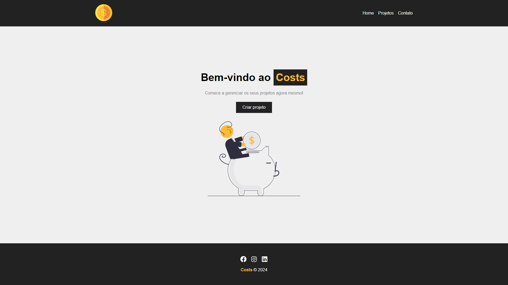
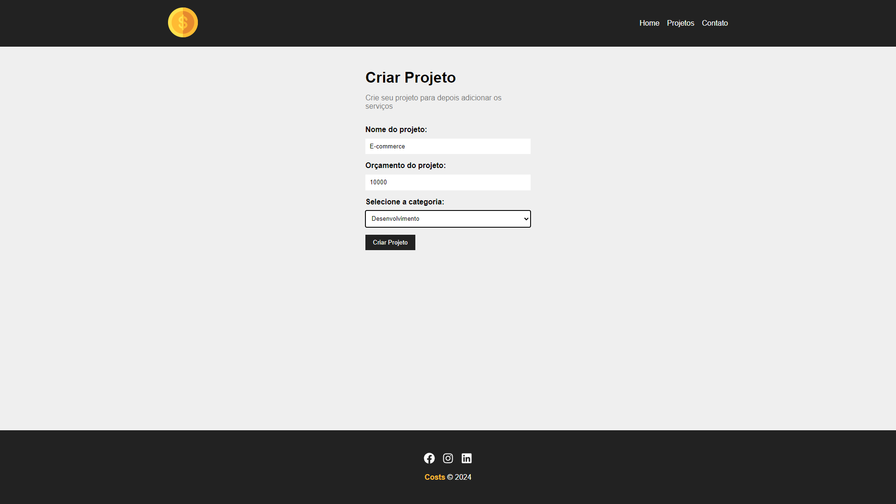
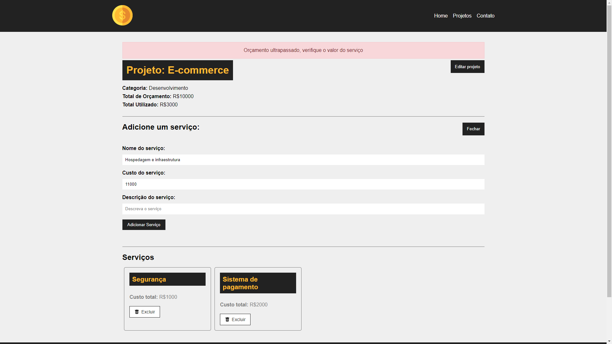

<div align="center"> <h1>Project Costs</h1> </div>

<p align="center">Gerencie o orçamento de seus projetos e controle os custos de cada serviço adicionado com facilidade.</p>

<p align="center">
  
  
  
  
  
</p>

## 📝 Sobre o projeto

O Project Costs é um sistema desenvolvido com React.js para ajudar na gestão de orçamentos de projetos. O usuário pode criar projetos e adicionar múltiplos serviços, cada um com detalhes sobre custos específicos. Se o custo total dos serviços ultrapassar o orçamento estabelecido, o sistema alerta o usuário. Além disso, é possível editar e excluir tanto os projetos quanto os serviços conforme necessário.

## 🛠 Tecnologias utilizadas
 
-   **React.js** - Biblioteca JavaScript para construção de interfaces
-   **JavaScript** - Linguagem de programação para desenvolvimento web
-   **HTML** - Linguagem de marcação que estrutura o conteúdo na web
-   **CSS** - Linguagem de estilos usada para definir o visual das interfaces web

## 📸 Screenshots

<p align="center">
  
</p>

<p align="center">
  
</p>

<p align="center">
  
</p>

## 🌐 Acesse o projeto online
Você pode acessar a versão online do projeto [aqui](https://project-costs.netlify.app).

## 🖥️ Como configurar o projeto

Siga os passos abaixo para instalar e executar o projeto em seu ambiente local:

### 1. Clone o repositório:

```bash
$ git clone https://github.com/mauricio071/project-costs
```

### 2. Acesse o diretório do projeto:

```bash
$ cd project-costs
```

### 3. Instale as dependências necessárias:

```bash
$ npm install
```

### 4. Configure o ambiente:
Para que o front-end consiga consumir a API, primeiro instale o projeto da API [aqui](https://github.com/mauricio071/project-costs-api) e configure o arquivo .env com a URL da API, como no exemplo:

```bash
REACT_APP_BASE_URL=http://localhost:3001/api
```

### 5. Inicialize o projeto:

```bash 
$ npm run start
```
Agora você pode acessar o projeto no navegador em http://localhost:3000 (ou na porta indicada pelo terminal).
